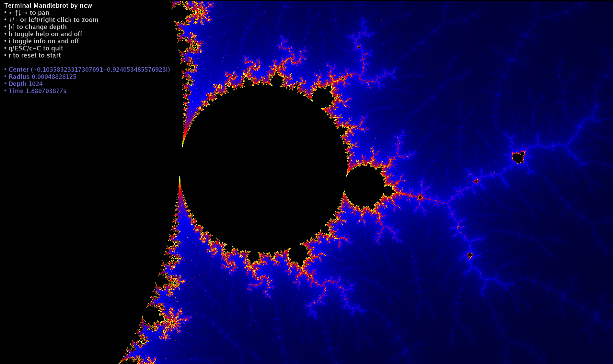
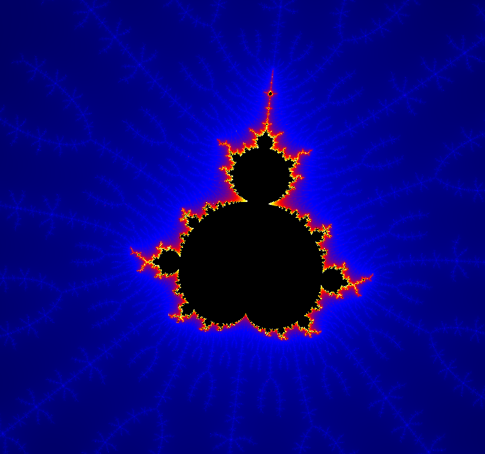
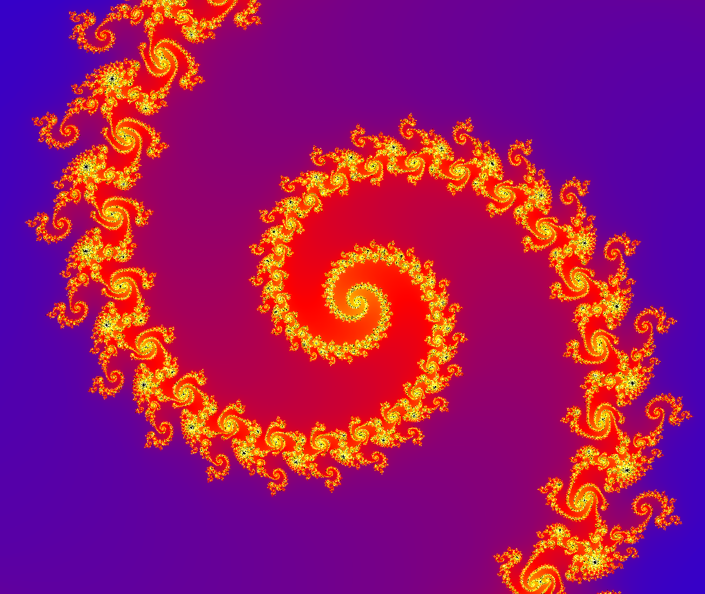
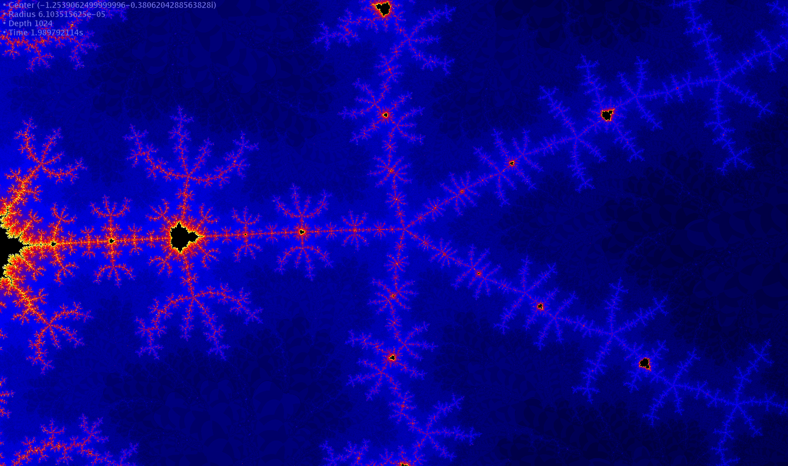

# Termbrot

Welcome to **Termbrot**, the fancy and futuristic successor to the acclaimed (and delightfully retro) [Mandelterm](https://github.com/ncw/mandelterm)!

Do you enjoy the infinite beauty of Mandelbrot sets but feel like ASCII art doesn't quite capture the magic? Do you have a terminal that can dazzle with inline images? Well, you've come to the right place.



## What is Termbrot?

**Termbrot** is a modern Mandelbrot renderer designed for fancy terminals that support inline images. Unlike its humble ancestor Mandelterm, which painted fractals with text characters, Termbrot brings full RGB splendor to your terminal window. It's like upgrading from a flip phone to a smartphone but with fractals!

## Features

- **Vibrant Colors**: Supports smooth gradient coloring for Mandelbrot sets that will make your terminal pop.
- **Interactive Exploration**: Use your keyboard and mouse to pan, zoom, and explore the infinite depths of the Mandelbrot set.
- **Fancy Terminal Support**: Works with iTerm2, Kitty, WezTerm, Ghostty and other modern terminals that support inline images.
- **Smooth Performance**: Optimized rendering ensures you can dive into fractal infinity without delay.

## Requirements

To enjoy Termbrot to its fullest, you'll need a terminal that supports inline images (e.g., [iTerm2](https://iterm2.com/), [Kitty](https://sw.kovidgoyal.net/kitty/), [WezTerm](https://wezfurlong.org/wezterm/index.html), [Ghostty](https://ghostty.org/)). If your terminal does not support inline images then all you'll get is a blank screen!

## Installation

Download the termbrot binary for your OS from the [releases page](https://github.com/ncw/termbrot/releases/latest). Alas Windows is not supported yet (ncw sheds a small fractal shaped tear).

## Installation using Go

Make sure you have go installed on your system (Go 1.22 or newer).

```bash
go get github.com/ncw/termbrot@latest
```

## Installation from source

Make sure you have go installed on your system (Go 1.22 or newer).

1. Clone the repository:
   ```bash
   git clone https://github.com/ncw/termbrot.git
   cd termbrot
   ```
2. Build the project:
   ```bash
   go build
   ```
3. Run Termbrot:
   ```bash
   ./termbrot
   ```

## Controls

- **Arrow Keys**: Pan the Mandelbrot set.
- **+ / -**: Zoom in and out.
- **Mouse Click**: Zoom and center the Mandelbrot view.
- **Right Mouse Click**: Zoom out and center the Mandelbrot view.
- **[ / ]**: Increase or decrease rendering depth.
- **H**: Toggle help overlay.
- **I**: Toggle info overlay.
- **D**: Toggle binary decompose.
- **R**: Reset to the default view.
- **Esc / Q**: Quit the program (but why would you?).

## Screenshots







## About

**Termbrot** is lovingly crafted by [ncw](https://github.com/ncw), who clearly has a penchant for naming projects after terminals and Mandelbrot sets. It stands as the next-generation fractal renderer for terminal enthusiasts.

If you long for the nostalgia of text-mode fractals, check out [Mandelterm](https://github.com/ncw/mandelterm), the charming ancestor of Termbrot. Together, they represent the evolution of fractal art in the terminal.

## Contributions

Got an idea to make Termbrot even fancier? Found a bug in the fractal depths? Contributions are welcome! Submit a pull request or open an issue.

## License

Termbrot is open source and available under the MIT License. Because fractals, like joy, should be shared freely.
